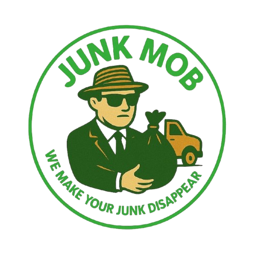

<p align="center">
  
</p>

<h1 align="center">Junk Mob — Junk Removal Website</h1>

<p align="center">
  <strong>Fast, affordable junk removal for Pierce County, WA</strong><br/>
  Tacoma • Puyallup • Lakewood • Federal Way • University Place
</p>

<p align="center">
  <a href="https://juancv3d.github.io/junkmob-website/">🌐 Live Site</a> •
  <a href="tel:+19546554193">📞 (954) 655-4193</a>
</p>

---

## Tech Stack

| Layer | Technology |
|-------|-----------|
| Framework | [Next.js 16](https://nextjs.org) (App Router, Static Export) |
| Language | TypeScript 5 |
| Styling | [Tailwind CSS v4](https://tailwindcss.com) with `@theme inline` tokens |
| Animations | [Framer Motion 12](https://motion.dev) |
| Icons | [Lucide React](https://lucide.dev) |
| Forms | [Web3Forms](https://web3forms.com) (serverless email delivery) |
| Deployment | GitHub Pages via GitHub Actions |
| Font | Inter (next/font) |

## Features

- **Pixel Canvas Hero** — Animated particle background with glass text effect
- **Animated Stats Counter** — Numbers count up on scroll (500+ customers, 4.9★ rating)
- **Bento Grid Services** — Featured card layout with hover glow effects
- **Testimonials Marquee** — Infinite scroll testimonials in dual rows
- **3-Tier Pricing** — Simple Small/Medium/Full pricing with "Get Quote" CTAs
- **Animated Headings** — Word-by-word blur reveal on scroll
- **Contact Form** — Sends quote requests directly to JunkMob email
- **FAQ Accordion** — Animated expandable FAQ section
- **Mobile Optimized** — Responsive design, no horizontal overflow
- **Smooth Scroll** — All anchor links scroll smoothly to sections

## Project Structure

```
src/
├── app/
│   ├── globals.css        # Tailwind + design tokens
│   ├── layout.tsx         # Root layout with Inter font
│   └── page.tsx           # Home page composition
├── components/
│   ├── ui/
│   │   └── PixelCanvas.tsx    # Canvas particle animation engine
│   ├── AnimatedHeading.tsx    # Reusable word-reveal heading
│   ├── Hero.tsx               # Pixel canvas hero section
│   ├── Services.tsx           # Bento grid services
│   ├── Pricing.tsx            # 3-tier pricing cards
│   ├── HowItWorks.tsx        # Steps + animated counters
│   ├── Testimonials.tsx       # Dual marquee testimonials
│   ├── About.tsx              # Team + gallery
│   ├── ContactForm.tsx        # Quote form + FAQ
│   ├── Navbar.tsx             # Fixed top navigation
│   └── Footer.tsx             # Footer with links
└── lib/
    └── utils.ts               # cn() utility
```

## Getting Started

```bash
# Install dependencies
npm install

# Run development server
npm run dev

# Build for production
npm run build
```

Open [http://localhost:3000](http://localhost:3000) to view locally.

## Deployment

The site auto-deploys to GitHub Pages on every push to `main` via the `.github/workflows/deploy.yml` action.

**Live URL:** https://juancv3d.github.io/junkmob-website/

## Design Tokens

```css
--primary-dark: #1B5E20
--primary: #2E7D32
--primary-light: #4CAF50
--accent-gold: #C8A415
--accent-gold-light: #E5C942
```

## Environment Variables

| Variable | Dev | Production |
|----------|-----|-----------|
| `NEXT_PUBLIC_BASE_PATH` | _(empty)_ | `/junkmob-website` |

---

<p align="center">
  Built for <strong>Junk Mob LLC</strong> — Pierce County's trusted junk removal service
</p>
